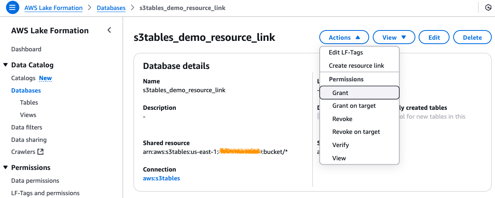
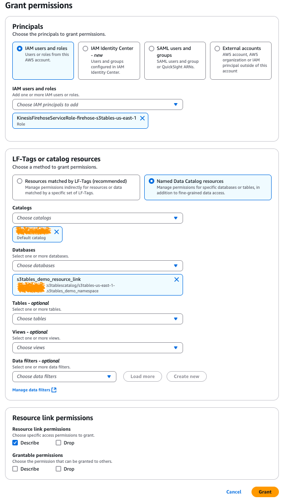
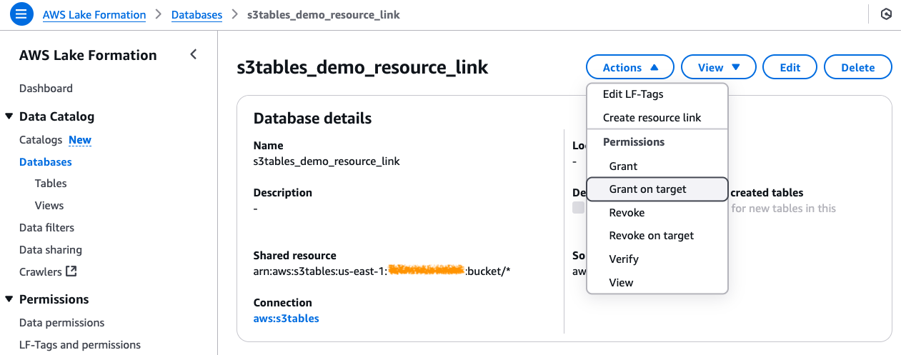
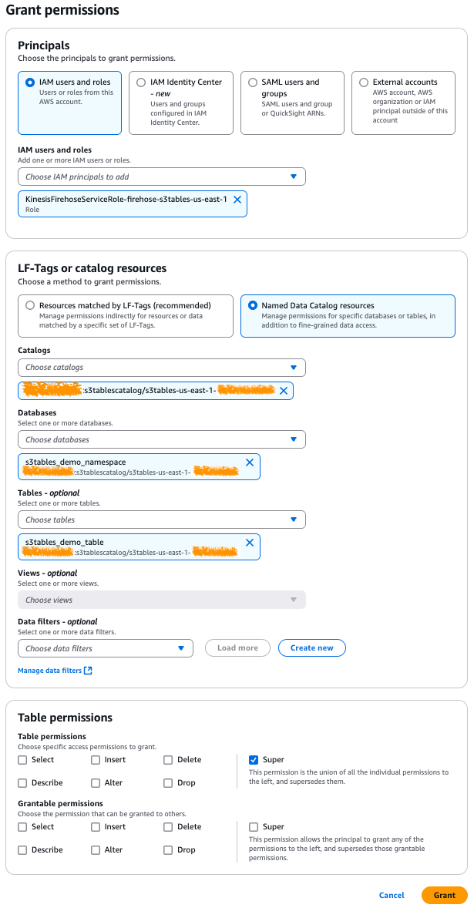
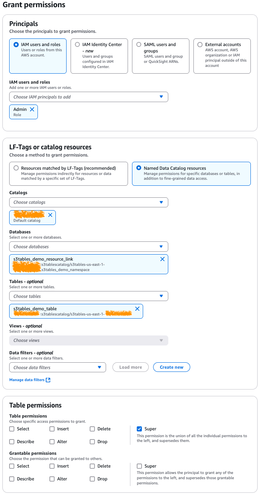
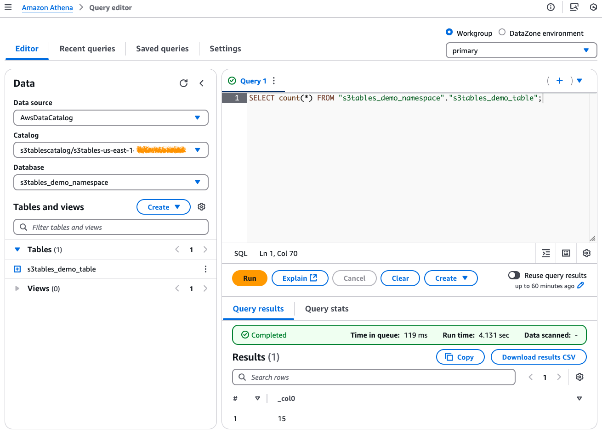

# Streaming data to Amazon S3 tables with Amazon Data Firehose

This is a CDK Python project to build a fully managed data lake using Amazon Data Firehose and S3 Tables to store and analyze real-time streaming data.


The `cdk.json` file tells the CDK Toolkit how to execute your app.

This project is set up like a standard Python project.  The initialization
process also creates a virtualenv within this project, stored under the `.venv`
directory.  To create the virtualenv it assumes that there is a `python3`
(or `python` for Windows) executable in your path with access to the `venv`
package. If for any reason the automatic creation of the virtualenv fails,
you can create the virtualenv manually.

To manually create a virtualenv on MacOS and Linux:

```
$ python3 -m venv .venv
```

After the init process completes and the virtualenv is created, you can use the following
step to activate your virtualenv.

```
$ source .venv/bin/activate
```

If you are a Windows platform, you would activate the virtualenv like this:

```
% .venv\Scripts\activate.bat
```

Once the virtualenv is activated, you can install the required dependencies.

```
(.venv) $ pip install -r requirements.txt
```

> To add additional dependencies, for example other CDK libraries, just add
them to your `setup.py` file and rerun the `pip install -r requirements.txt`
command.

## Prerequisites

Before synthesizing the CloudFormation, you should set approperly the cdk context configuration file, `cdk.context.json`.

In this project, we use the following cdk context:
<pre>
{
  "data_firehose_configuration": {
    "stream_name": "firehose-s3tables",
    "buffering_hints": {
      "interval_in_seconds": 60,
      "size_in_mbs": 128
    },
    "destination_iceberg_table_configuration": {
      "database_name": "s3tables_demo_resource_link",
      "table_name": "s3tables_demo_table"
    },
    "error_output_prefix": "error/year=!{timestamp:yyyy}/month=!{timestamp:MM}/day=!{timestamp:dd}/hour=!{timestamp:HH}/!{firehose:error-output-type}"
  },
  "s3_tables": {
    "namespace_name": "s3tables_demo_namespace",
    "table_name": "s3tables_demo_table"
  }
}
</pre>

## Deploy

At this point you can now synthesize the CloudFormation template for this code.

```
(.venv) $ export CDK_DEFAULT_ACCOUNT=$(aws sts get-caller-identity --query Account --output text)
(.venv) $ export CDK_DEFAULT_REGION=$(aws configure get region)
(.venv) $ cdk synth --all
```

Now let's try to deploy.

#### List all CDK Stacks

```
(.venv) $ cdk list
FirehoseToS3TablesTableBucket
FirehoseToS3TablesResourceLink
FirehoseToS3TablesS3ErrorOutputPath
FirehoseToS3TablesRole
FirehoseToS3TablesGrantLFPermissionsOnFirehoseRole
FirehoseToS3TablesDeliveryStream
```

#### Deploy CDK Stacks one after the other

1. Create an S3 table bucket and integrate with AWS Analytics services
   <pre>
   (.venv) $ cdk deploy --require-approval never FirehoseToS3TablesTableBucket
   </pre>
2. Create a namespace in the table bucket
   <pre>
   S3TABLE_BUCKET_ARN=$(aws cloudformation describe-stacks --stack-name FirehoseToS3TablesTableBucket | jq -r '.Stacks[0].Outputs[] | select(.OutputKey == "S3TableBucketArn") | .OutputValue')

   aws s3tables create-namespace \
                --table-bucket-arn ${S3TABLE_BUCKET_ARN} \
                --namespace s3tables_demo_namespace
   </pre>
3. Create a table in the table bucket

   Using AWS CLI, [create a table](https://docs.aws.amazon.com/AmazonS3/latest/userguide/s3-tables-create.html) in the existing namespace in the table bucket as `s3tables_demo_table`. When you create a table, you can also define a schema for the table. For this project, we create a table with a schema consisting of three fields: `id`, `name`, and `value`.
   <pre>
   S3TABLE_BUCKET_ARN=$(aws cloudformation describe-stacks --stack-name FirehoseToS3TablesTableBucket | jq -r '.Stacks[0].Outputs[] | select(.OutputKey == "S3TableBucketArn") | .OutputValue')

   aws s3tables create-table --cli-input-json file://mytabledefinition.json
   </pre>
   The following is the sample `mytabledefinition.json` used to set the table schema.
   ```json
   {
     "tableBucketARN": "arn:aws:s3tables:<region>:<account-id>:bucket/<s3tablebucket>",
     "namespace": "s3tables_demo_namespace",
     "name": "s3tables_demo_table",
     "format": "ICEBERG",
     "metadata": {
     "iceberg": {
       "schema": {
        "fields": [
          {"name": "id", "type": "int", "required": true},
          {"name": "name", "type": "string"},
          {"name": "value", "type": "int"}
        ]
       }
      }
     }
   }
   ```
   :information_source: For more information, see [here](https://docs.aws.amazon.com/AmazonS3/latest/userguide/s3-tables-create.html).
4. Create a resource link to the namespace
   <pre>
   (.venv) $ cdk deploy --require-approval never FirehoseToS3TablesResourceLink
   </pre>
5. Create an IAM role for Data Firehose
   <pre>
   (.venv) $ cdk deploy --require-approval never FirehoseToS3TablesS3ErrorOutputPath FirehoseToS3TablesRole
   </pre>
6. Configure AWS Lake Formation permissions

   AWS Lake Formation manages access to your table resources. For Data Firehose to ingest data into table buckets, the Data Firehose role (created in step 5) requires `DESCRIBE` permissions on the resource link (created in step 4) to discover the S3 Tables namespace through the resource link and **read/write permission** on the underlying table.
   <pre>
   (.venv) $ cdk deploy --require-approval never FirehoseToS3TablesGrantLFPermissionsOnFirehoseRole
   </pre>

   :information_source: The above command is the same as manually adding LakeFormation permissions to the DataFire role as follows:

   > To add describe permissions on the resource link, navigate to [Lake Formation](https://console.aws.amazon.com/lakeformation/) in the Console. Choose **Databases** on the left menu, and then choose the resource link you created in Step 4. Choose **Actions**, choose **Grant**, and then grant **Describe** permission to the Data Firehose role, as shown in the following figures.<br/>
   
   > <br/>In this example, the Data Firehose role is named `KinesisFirehoseServiceRole-firehose-s3tables-<region>`.<br/>
   > 
   > <br/>To provide read and write permission on specific tables, go back and choose **Databases** on the left menu, then choose the resource link you created in Step 4. First, choose **Actions**, and then choose **Grant on target**.<br/>
   > 
   > <br/>Choose the Data Firehose role, databases, and tables, then grant **Super** permission to the Data Firehose role, as shown in the following figures.<br/>
   > 
7. Set up a Data Firehose stream
   <pre>
   (.venv) $ cdk deploy --require-approval never FirehoseToS3TablesDeliveryStream
   </pre>

## Run Test

1. Generate test data
   <pre>
   (.venv) $ pip install -U "boto3>=1.24.41" "mimesis==18.0.0"
   (.venv) $ STREAM_NAME=$(aws cloudformation describe-stacks --stack-name FirehoseToS3TablesDeliveryStream | jq -r '.Stacks[0].Outputs[] | select(.OutputKey == "DataFirehoseStreamName") | .OutputValue')
   (.venv) $ python src/utils/gen_fake_data.py --stream-name ${STREAM_NAME} --console
   </pre>
2. Verify and query data using Athena

   To query the data using [Athena](https://console.aws.amazon.com/athena/home), you must grant AWS Lake Formation permissions on the S3 table to the user or role you plan to use for Athena queries. In the left navigation pane of the Lake Formation console, choose **Data permissions** and choose **Grant**, and then choose the user/role you will use to access Athena under **Principals**. In the **LF-Tags** or **Catalog resources** choose **Named Data Catalog resources**, **Default catalog**, and the resource link associated with your S3 table bucket. Then choose the S3 table and grant **Super** under Table permissions, as shown in the following figure.
   

   To query and verify data ingested from Firehose, run a `SELECT` command in Athena as shown in the following figure. As long as data is being streamed from Kinesis Data Firehose, you should continue to see the row count increasing in this table, confirming successful data ingestion.
   <pre>
   SELECT COUNT(*)
   FROM "s3tables_demo_namespace"."s3tables_demo_table";
   </pre>

   

## Clean Up

Delete the CloudFormation stacks by running the below command.

```
(.venv) $ cdk destroy --all
```

## Useful commands

 * `cdk ls`          list all stacks in the app
 * `cdk synth`       emits the synthesized CloudFormation template
 * `cdk deploy`      deploy this stack to your default AWS account/region
 * `cdk diff`        compare deployed stack with current state
 * `cdk docs`        open CDK documentation

Enjoy!

## References

 * [Streaming data to S3 tables with Amazon Data Firehose](https://docs.aws.amazon.com/AmazonS3/latest/userguide/s3-tables-integrating-firehose.html)
 * [(AWS Blog) Build a data lake for streaming data with Amazon S3 Tables and Amazon Data Firehose (2025-03-04)](https://aws.amazon.com/blogs/storage/build-a-data-lake-for-streaming-data-with-amazon-s3-tables-and-amazon-data-firehose/)
 * [Simplify data lakes at scale with Amazon S3 Tables](https://community.aws/content/2unzJtZ4QhdCa5dVUnPFCohLcHi)
   * [(YouTube) Simplify data lakes at scale with Amazon S3 Tables](https://youtu.be/gXQE5LgpooY)
 * [Tutorial: Getting started with S3 Tables](https://docs.aws.amazon.com/AmazonS3/latest/userguide/s3-tables-getting-started.html)
 * [Creating an Amazon S3 table](https://docs.aws.amazon.com/AmazonS3/latest/userguide/s3-tables-create.html)
 * [(GitHub) aws-samples/sample-for-transactional-datalake-using-s3tables](https://github.com/aws-samples/sample-for-transactional-datalake-using-s3tables.git)
