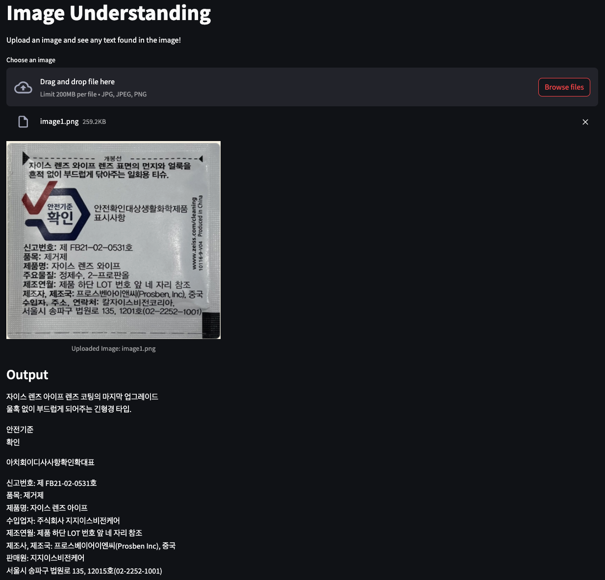

# OCR Web App using Amazon Bedrock and ECS Fargate


This is an OCR(Optical Character Recognition) Web Application using Amazon Bedrock deployed on Amazon ECS Fargate with Amazon CDK.

The `cdk.json` file tells the CDK Toolkit how to execute your app.

This project is set up like a standard Python project.  The initialization
process also creates a virtualenv within this project, stored under the `.venv`
directory.  To create the virtualenv it assumes that there is a `python3`
(or `python` for Windows) executable in your path with access to the `venv`
package. If for any reason the automatic creation of the virtualenv fails,
you can create the virtualenv manually.

To manually create a virtualenv on MacOS and Linux:

```
$ python3 -m venv .venv
```

After the init process completes and the virtualenv is created, you can use the following
step to activate your virtualenv.

```
$ source .venv/bin/activate
```

If you are a Windows platform, you would activate the virtualenv like this:

```
% .venv\Scripts\activate.bat
```

Once the virtualenv is activated, you can install the required dependencies.

```
(.venv) $ pip install -r requirements.txt
```

At this point you can now synthesize the CloudFormation template for this code.

```
(.venv) $ cdk synth --all
```

To add additional dependencies, for example other CDK libraries, just add
them to your `setup.py` file and rerun the `pip install -r requirements.txt`
command.

### Prerequsites

In this project Amazon Bedrock foundation models (e.g., `Anthropic Claude 3`) is used for OCR(image-to-text).
However, access to Amazon Bedrock foundation models isn't granted by default.
In order to gain access to a foundation model, select **Model access** at the bottom of the left navigation pane in the Amazon Bedrock management console.
The model access page lets you view a list of available models, the output modality of the model, whether you have been granted access to it, and the **End User License Agreement (EULA)**.
You should review the EULA for terms and conditions of using a model before requesting access to it.

:information_source: You can manage model access only through the console.

### Deploy

Now you are ready to synthesize the CloudFormation template for this code.

```
(.venv) $ export CDK_DEFAULT_ACCOUNT=$(aws sts get-caller-identity --query Account --output text)
(.venv) $ export CDK_DEFAULT_REGION=$(curl -s 169.254.169.254/latest/dynamic/instance-identity/document | jq -r .region)
(.venv) $ cdk synth --all
```

Use `cdk deploy` command to create the stack shown above.
:warning: Before deploy CDK stacks, make sure **Docker is runing** on your machine.

```
(.venv) $ cdk deploy --require-approval never --all
```

### Listing all CDK Stacks

```
(.venv) $ cdk list
OCRAppVpcStack
OCRAppECSClusterStack
OCRAppECSTaskStack
OCRAppECSAlbFargateServiceStack
```

Once all CDK Stacks have been deployed successfully, youn can find out a data dashboard url by running the following command:
<pre>
aws cloudformation describe-stacks --stack-name <i>OCRAppECSAlbFargateServiceStack</i> | jq -r '.Stacks[0].Outputs | .[] | select(.OutputKey | endswith("LoadBalancerDNS")) | .OutputValue'
</pre>

  > :information_source: `OCRAppECSAlbFargateServiceStack` is a CDK Stack to create an Application Load Balancer for the OCR Web Application.

Then you can access the dashboard through a browser.

The following screenshot shows the app with a sample image in `samples` directory.




## Clean Up

Delete the CloudFormation stack by running the below command.

```
(.venv) $ cdk destroy --force --all
```


## Useful commands

 * `cdk ls`          list all stacks in the app
 * `cdk synth`       emits the synthesized CloudFormation template
 * `cdk deploy`      deploy this stack to your default AWS account/region
 * `cdk diff`        compare deployed stack with current state
 * `cdk docs`        open CDK documentation

Enjoy!


## References

 * [Building with Amazon Bedrock and LangChain](https://catalog.workshops.aws/building-with-amazon-bedrock/en-US)
 * [Amazon Bedrock Workshop](https://catalog.us-east-1.prod.workshops.aws/workshops/a4bdb007-5600-4368-81c5-ff5b4154f518/en-US)
 * [(github) amazon-bedrock-samples](https://github.com/aws-samples/amazon-bedrock-samples)
 * [Prompt Engineering with Anthropic's Claude v3](https://catalog.us-east-1.prod.workshops.aws/workshops/0644c9e9-5b82-45f2-8835-3b5aa30b1848/en-US)
 * [Amazon ECS Blueprints](https://github.com/aws-ia/ecs-blueprints)
 * [Streamlit](https://streamlit.io/) - Streamlit turns data scripts into shareable web apps in minutes.
