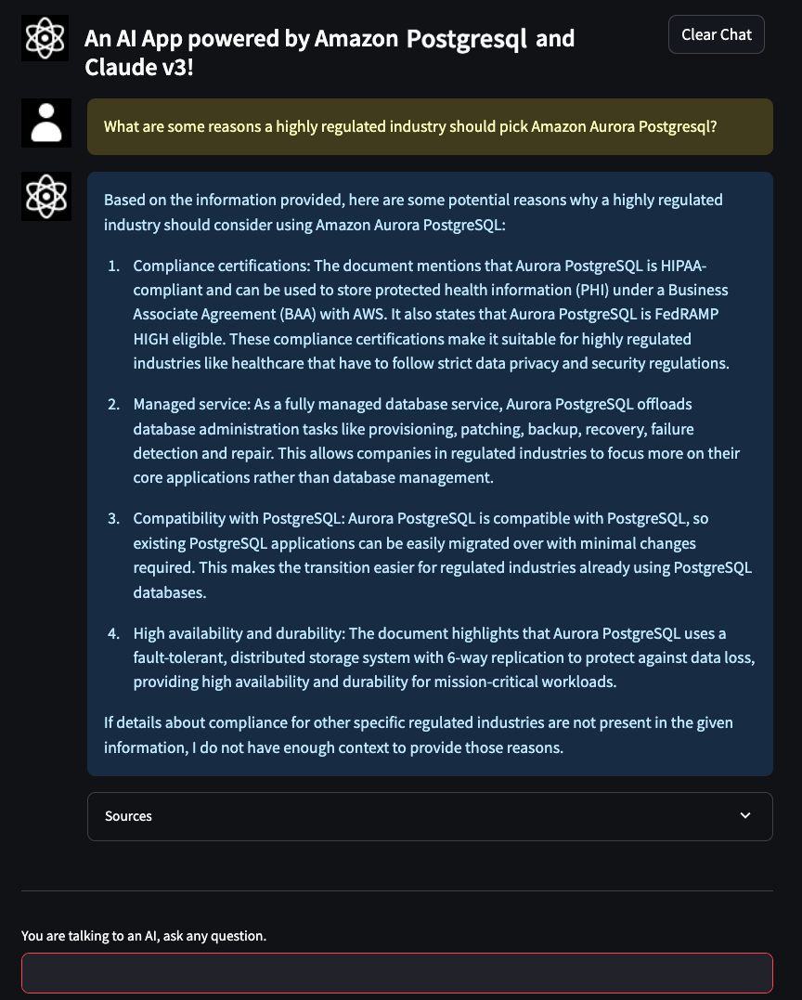

## Run the Streamlit application in Studio

Now we’re ready to run the Streamlit web application for our question answering bot.

SageMaker Studio provides a convenient platform to host the Streamlit web application. The following steps describe how to run the Streamlit app on SageMaker Studio. Alternatively, you could also follow the same procedure to run the app on Amazon EC2 instance or Cloud9 in your AWS Account.

1. Open JupyterLab and then open a new **Terminal**.
2. Run the following commands on the terminal to clone the code repository for this post and install the Python packages needed by the application:
   ```
   git clone --depth=1 https://github.com/aws-samples/aws-kr-startup-samples.git
   cd aws-kr-startup-samples
   git sparse-checkout init --cone
   git sparse-checkout set gen-ai/rag-with-amazon-bedrock-and-postgresql-using-pgvector

   cd gen-ai/rag-with-amazon-bedrock-and-postgresql-using-pgvector/app
   python -m venv .env
   source .env/bin/activate
   pip install -r requirements.txt
   ```
3. In the shell, set the following environment variables with the values that are available from the CloudFormation stack output.
   ```
   export AWS_REGION="<YOUR-AWS-REGION>"
   export PGVECTOR_SECRET_ID="<YOUR-POSTGRESQL-SECRET>"
   export COLLECTION_NAME="llm_rag_embeddings"
   export BEDROCK_MODEL_ID="anthropic.claude-3-sonnet-20240229-v1:0"
   ```
   :information_source: `COLLECTION_NAME` can be found in [data ingestion to vectordb](../data_ingestion_to_vectordb/data_ingestion_to_pgvector.ipynb) step.
4. When the application runs successfully, you’ll see an output similar to the following (the IP addresses you will see will be different from the ones shown in this example). Note the port number (typically `8501`) from the output to use as part of the URL for app in the next step.
   ```
   sagemaker-user@studio$ streamlit run app.py

   Collecting usage statistics. To deactivate, set browser.gatherUsageStats to False.

   You can now view your Streamlit app in your browser.

   Network URL: http://169.255.255.2:8501
   External URL: http://52.4.240.77:8501
   ```
5. You can access the app in a new browser tab using a URL that is similar to your Studio domain URL. For example, if your Studio URL is `https://d-randomidentifier.studio.us-east-1.sagemaker.aws/jupyter/default/lab?` then the URL for your Streamlit app will be `https://d-randomidentifier.studio.us-east-1.sagemaker.aws/jupyter/default/proxy/8501/app` (notice that `lab` is replaced with `proxy/8501/app`). If the port number noted in the previous step is different from `8501` then use that instead of `8501` in the URL for the Streamlit app.

   The following screenshot shows the app with a couple of user questions. (e.g., `What are some reasons a highly regulated industry should pick Amazon Aurora Postgresql?`)

   

## References

  * [Amazon Bedrock Workshop](https://github.com/aws-samples/amazon-bedrock-workshop)
  * [Leverage pgvector and Amazon Aurora PostgreSQL for Natural Language Processing, Chatbots and Sentiment Analysis (2023-07-13)](https://aws.amazon.com/blogs/database/leverage-pgvector-and-amazon-aurora-postgresql-for-natural-language-processing-chatbots-and-sentiment-analysis/)
  * [Building AI-powered search in PostgreSQL using Amazon SageMaker and pgvector (2023-05-03)](https://aws.amazon.com/blogs/database/building-ai-powered-search-in-postgresql-using-amazon-sagemaker-and-pgvector/)
  * [Build Streamlit apps in Amazon SageMaker Studio (2023-04-11)](https://aws.amazon.com/blogs/machine-learning/build-streamlit-apps-in-amazon-sagemaker-studio/)
  * [Quickly build high-accuracy Generative AI applications on enterprise data using Amazon Kendra, LangChain, and large language models (2023-05-02)](https://aws.amazon.com/blogs/machine-learning/quickly-build-high-accuracy-generative-ai-applications-on-enterprise-data-using-amazon-kendra-langchain-and-large-language-models/)
  * [Amazon Bedrock - Inference parameters for foundation models](https://docs.aws.amazon.com/bedrock/latest/userguide/model-parameters.html)
  * [LangChain](https://python.langchain.com/v0.1/docs/get_started/introduction.html) - A framework for developing applications powered by language models.
  * [LangChain Providers - AWS](https://python.langchain.com/v0.1/docs/get_started/introduction.html) - The `LangChain` integrations related to `Amazon AWS` platform.
  * [Streamlit](https://streamlit.io/) - A faster way to build and share data apps

## Troubleshooting

  * [Bedrock API call error: Your account is not authorized to invoke this API operation.](https://repost.aws/de/questions/QUksxQi1VkRfez5TvYF2sXhw/bedrock-api-call-error-your-account-is-not-authorized-to-invoke-this-api-operation)
    <pre>
    Error raised by bedrock service: An error occurred (AccessDeniedException) when calling the InvokeModelWithResponseStream operation: Your account is not authorized to invoke this API operation.
    </pre>
  * [Amazon Bedrock - Add model access](https://docs.aws.amazon.com/bedrock/latest/userguide/model-access.html#add-model-access)
  * [Identity-based policy examples for Amazon Bedrock](https://docs.aws.amazon.com/bedrock/latest/userguide/security_iam_id-based-policy-examples.html)
  * [Troubleshooting Amazon Bedrock identity and access](https://docs.aws.amazon.com/bedrock/latest/userguide/security_iam_troubleshoot.html)
