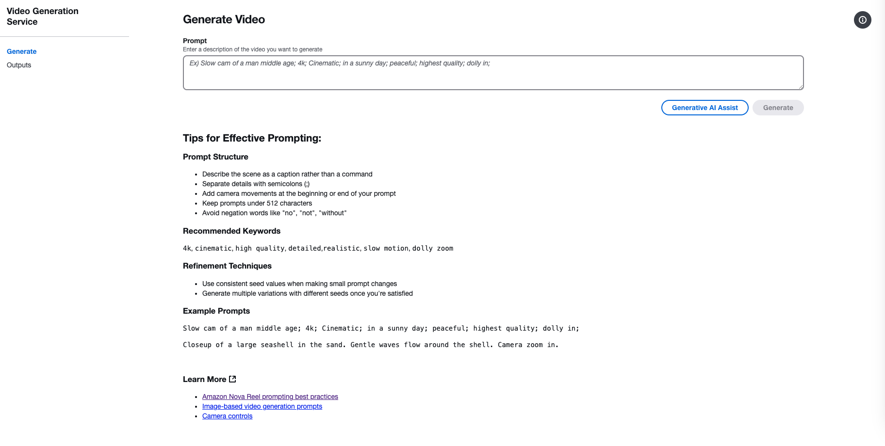
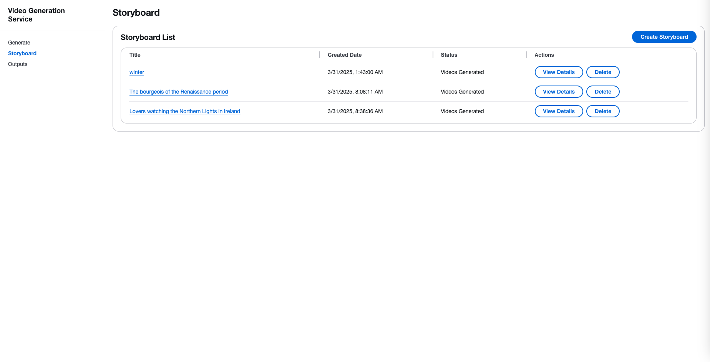
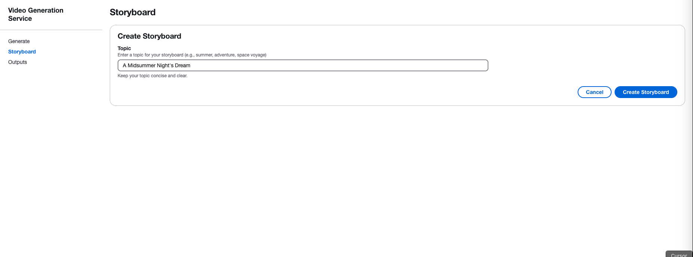
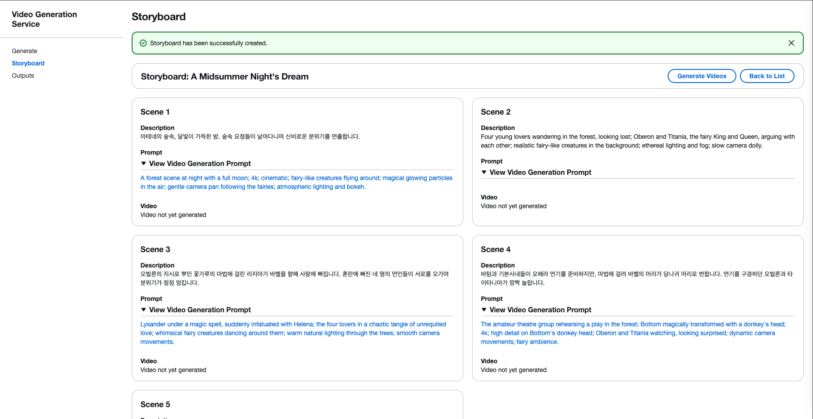

# Video Maker with Amazon Bedrock(Nova Reel)

## Project Overview
This project is a video creation automation system using Amazon Bedrock(Nova Reel). It is built using AWS CDK for infrastructure and consists of frontend and backend components.


You can get help from "Generative AI Assist" to get suggested prompts based on best practices from Amazon Nova Reel.


## Storyboard
Simply enter a topic and create your own story.



 The Claude Sonnet 3.5 will determine the scenario with just prompts, and you can merge the step-by-step videos that are created.

Check out the suggested prompts and stories for Nova Reel Best Practices Prompts.


Select "Generate Videos" and once the video is generated, merge the videos with "Merge Videos". After that, you can check the 30-second video starting with merged_ in the Outputs category.

example - Lovers watching the Northern Lights in Ireland


## System Architecture
- Frontend: React-based web application
- Backend: Serverless architecture using AWS CDK
  - AWS Lambda
  - Amazon S3
  - Other AWS services

## Installation and Deployment

### Backend Deployment
Follow these steps to deploy the backend:

```bash
# Navigate to backend directory
cd backend

# Install required dependencies
pip install -r requirements.txt

# Deploy using AWS CDK
cdk deploy
```

### FFmpeg Lambda Layer Installation (Storyboard Video Merge)
For the video merging functionality of the storyboard feature, you'll need the FFmpeg Lambda Layer. Follow these steps to install it:

1. Visit the [FFmpeg Lambda Layer link.](https://serverlessrepo.aws.amazon.com/applications/us-east-1/145266761615/ffmpeg-lambda-layer)
2. Click the "Deploy" button to deploy the application.
3. Once deployment is complete, find the "VideoMakerWithNovaReelSta-MergeVideosLambda" function in the Lambda console.
4. Select "Layers" from the "Configuration" tab.
5. Click the "Add a layer" button.
6. Select "AWS layers" and add the FFmpeg Layer you deployed.

### Frontend Deployment
Follow these steps to deploy the frontend:

```bash
# Navigate to frontend directory
cd frontend

# change API Gateway Endpoint from CDK Outputs(VideoMakerWithNovaReelStack.VideoMakerWithNovaReelAPIGateway)
vi .env
REACT_APP_API_HOST=https://xxxxxxxxxx.execute-api.us-east-1.amazonaws.com/prod

# Install dependencies
npm install

# Build for production
npm run build

# Start on Localhost
npm start
```

## Prerequisites
- Node.js 16.x or higher
- Python 3.8 or higher
- AWS CLI configured
- AWS CDK CLI installed

## Features
- Automated video creation
- Cloud-based processing
- Scalable architecture
- Easy deployment process

## Configuration
Make sure to set up your AWS credentials and configure the necessary environment variables before deployment.

## Support
For support, please open an issue in the GitHub repository.