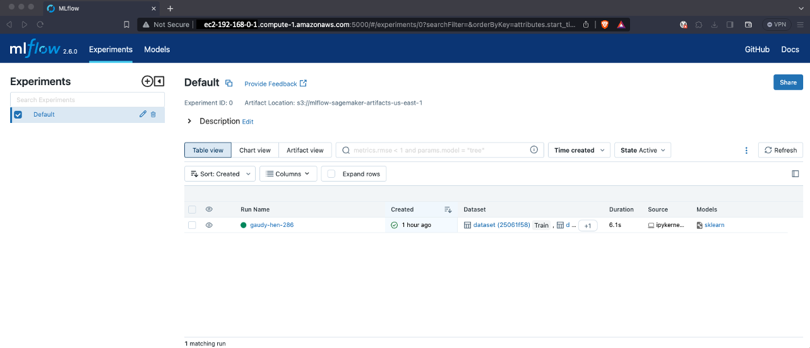

# MLflow on Amazon EC2 with Amazon SageMaker


This is a MLflow project on Amazon EC2 instance for CDK development with Python.

The `cdk.json` file tells the CDK Toolkit how to execute your app.

This project is set up like a standard Python project.  The initialization
process also creates a virtualenv within this project, stored under the `.venv`
directory.  To create the virtualenv it assumes that there is a `python3`
(or `python` for Windows) executable in your path with access to the `venv`
package. If for any reason the automatic creation of the virtualenv fails,
you can create the virtualenv manually.

To manually create a virtualenv on MacOS and Linux:

```
$ git clone --depth=1 https://github.com/aws-samples/aws-kr-startup-samples.git
$ cd aws-kr-startup-samples
$ git sparse-checkout init --cone
$ git sparse-checkout set machine-learning/mlflow/mlflow-ec2-sagemaker
$ cd machine-learning/mlflow/mlflow-ec2-sagemaker
$ python3 -m venv .venv
```

After the init process completes and the virtualenv is created, you can use the following
step to activate your virtualenv.

```
$ source .venv/bin/activate
```

If you are a Windows platform, you would activate the virtualenv like this:

```
% .venv\Scripts\activate.bat
```

Once the virtualenv is activated, you can install the required dependencies.

```
(.venv) $ pip install -r requirements.txt
```

Before synthesizing the CloudFormation, you should set approperly the cdk context configuration file, `cdk.context.json`.

For example:

```
{
  "ami_name": "ubuntu/images/hvm-ssd/ubuntu-focal-20.04-amd64-server-20230517",
  "vpc_name": "default"
}
```

At this point you can now synthesize the CloudFormation template for this code.

```
(.venv) $ export CDK_DEFAULT_ACCOUNT=$(aws sts get-caller-identity --query Account --output text)
(.venv) $ export CDK_DEFAULT_REGION=$(aws configure get region)
(.venv) $ cdk synth --all
```

Use `cdk deploy` command to create the stack shown above,

```
(.venv) $ export CDK_DEFAULT_ACCOUNT=$(aws sts get-caller-identity --query Account --output text)
(.venv) $ export CDK_DEFAULT_REGION=$(aws configure get region)
(.venv) $ cdk deploy --require-approval never --all
```

To add additional dependencies, for example other CDK libraries, just add
them to your `setup.py` file and rerun the `pip install -r requirements.txt`
command.


## Running Test

1. Open the jupyter notebook, `training_job_on_premise.ipynb` in `example/sklearn_diabetes_regression` directory on your jupyter lab.
2. Replace `MLFLOW_TRACKING_URI` with the mlflow server deployed on the Amazon EC2 instance.
3. Run all cells in `training_job_on_premise.ipynb`.
4. Open the mlflow web in your browser and you can see the screen like this:
   
5. Launch Amazon SageMaker Studio
6. Upload `deploy_mlflow_model_to_sagemaker.ipynb` file in `example/sklearn_diabetes_regression` directory to the SageMaker Studio.
7. Set `MLFLOW_TRACKING_URI`
8. Run all cells in `deploy_mlflow_model_to_sagemaker.ipynb`.


## Clean Up

Delete the CloudFormation stack by running the below command.

```
(.venv) $ cdk destroy --force --all
```

## Useful commands

 * `cdk ls`          list all stacks in the app
 * `cdk synth`       emits the synthesized CloudFormation template
 * `cdk deploy`      deploy this stack to your default AWS account/region
 * `cdk diff`        compare deployed stack with current state
 * `cdk docs`        open CDK documentation

Enjoy!

## References

 * [(AWS Blog) Managing your machine learning lifecycle with MLflow and Amazon SageMaker (2021-01-28)](https://aws.amazon.com/blogs/machine-learning/managing-your-machine-learning-lifecycle-with-mlflow-and-amazon-sagemaker/)
   * [(GitHub Repo) amazon-sagemaker-mlflow-fargate](https://github.com/ksmin23/amazon-sagemaker-mlflow-fargate)
 * [MLflow Documentation](https://mlflow.org/docs/latest/index.html)
 * [Supervisor: A Process Control System](http://supervisord.org/)
   * Installing `supervisor`
     ```
     sudo apt install supervisor
     ```
     or
     ```
     pip install supervisor
     ```
   * Running `supervisord` - start, stop, restart
     ```
     sudo service supervisor start
     sudo service supervisor stop
     sudo service supervisor restart
     ```
   * Running `supervisorctl``
     ```
     $ sudo supervisorctl
     supervisor> help

     default commands (type help <topic>):
     =====================================
     add    exit      open  reload  restart   start   tail
     avail  fg        pid   remove  shutdown  status  update
     clear  maintail  quit  reread  signal    stop    version

     supervisor> help status
     status <name>		Get status for a single process
     status <gname>:*	Get status for all processes in a group
     status <name> <name>	Get status for multiple named processes
     status			Get all process status info
     supervisor> status mlflow
     mlflow                           RUNNING   pid 31607, uptime 0:00:01
     supervisor>
     ```
 * [How to use supervisor in 10 minutes](https://devlog.jwgo.kr/2016/11/07/how-to-use-supervisor-in-one-minute/)
 * [(**StackOverflow**) Pip is not working for Python 3.10 on Ubuntu](https://stackoverflow.com/questions/69503329/pip-is-not-working-for-python-3-10-on-ubuntu)
   * Install `python 3.10`, `pip` and `venv`` in Ubuntu 18|20
     ```
     sudo apt update && sudo apt upgrade -y
     sudo apt install software-properties-common -y
     sudo add-apt-repository -y ppa:deadsnakes/ppa
     sudo apt install -y python3.10
     sudo apt install -y python3.10-distutils
     python3.10 --version
     curl -sS https://bootstrap.pypa.io/get-pip.py | python3.10
     python3.10 -m pip --version
     python3.10 -m pip install --upgrade pip
     sudo apt install -y python3.10-venv
     ```
 * [How to Use update-alternatives Command on Ubuntu](https://linuxhint.com/update_alternatives_ubuntu/)
 * [Connect using the EC2 Instance Connect CLI](https://docs.aws.amazon.com/AWSEC2/latest/UserGuide/ec2-instance-connect-methods.html#ec2-instance-connect-connecting-ec2-cli)
   <pre>
   $ sudo pip install ec2instanceconnectcli
   $ mssh ubuntu@<i>i-001234a4bf70dec41EXAMPLE</i> # ec2-instance-id with <i>ubuntu</i> user
   </pre>